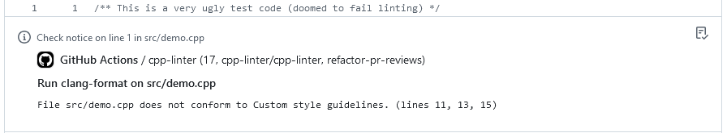
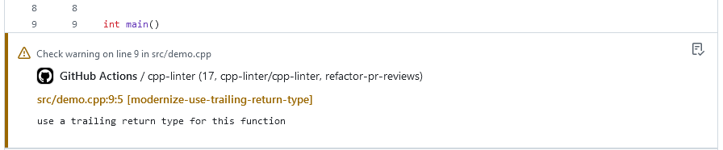
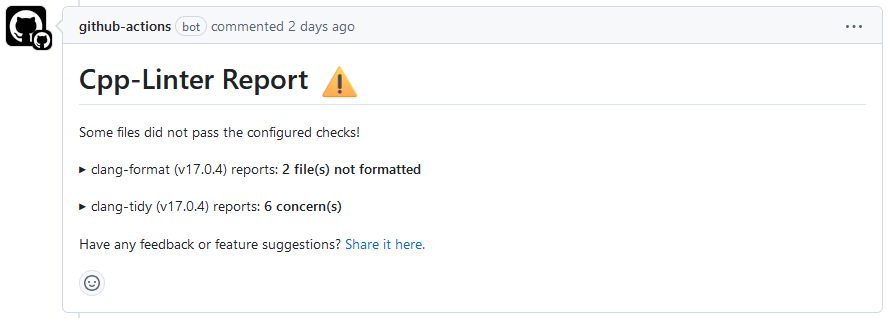
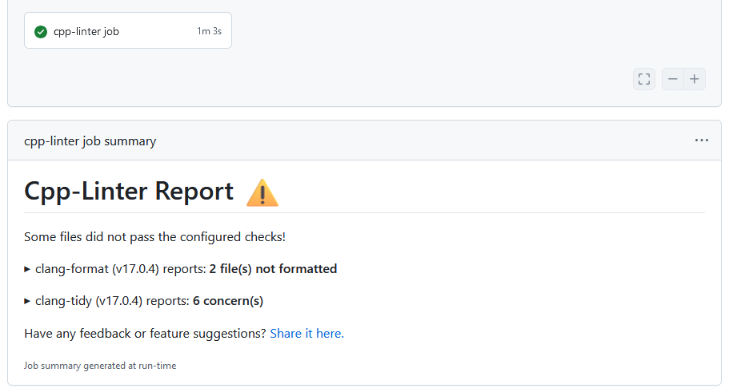
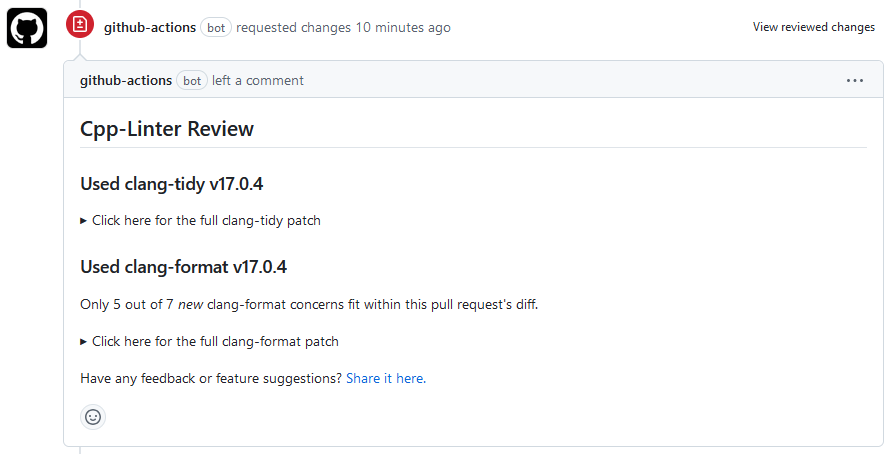
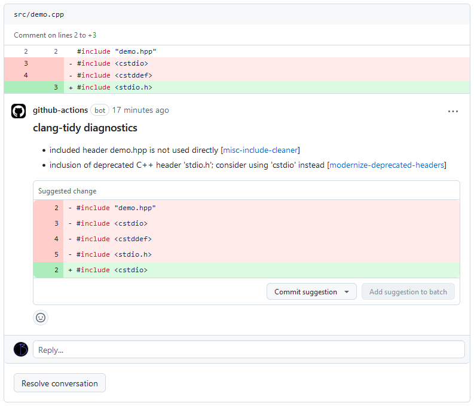
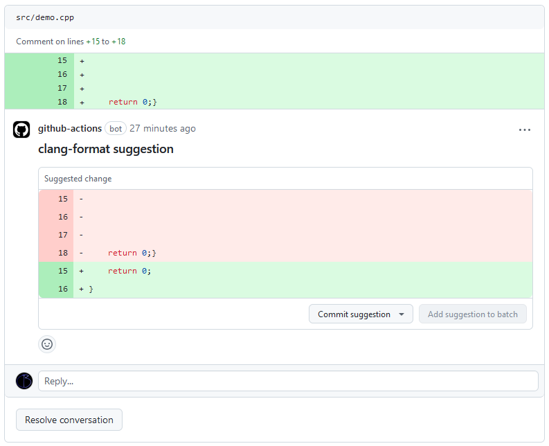

<!-- markdownlint-disable MD041 MD033 -->

[file-annotations]: https://cpp-linter.github.io/cpp-linter-rs/cli#-a-file-annotations
[thread-comments]: https://cpp-linter.github.io/cpp-linter-rs/cli#-g-thread-comments
[step-summary]: https://cpp-linter.github.io/cpp-linter-rs/cli#-w-step-summary
[tidy-review]: https://cpp-linter.github.io/cpp-linter-rs/cli#-d-tidy-review
[format-review]: https://cpp-linter.github.io/cpp-linter-rs/cli#-m-format-review
[other-licenses]: https://cpp-linter.github.io/cpp-linter-rs/other-licenses

[cli-doc]: https://cpp-linter.github.io/cpp-linter-rs/cli

<!-- start -->
[![Python packaging][py-build-badge]][py-build-ci]
[![Binary executable builds][bin-build-badge]][bin-build-ci]
[![node-js builds][node-ci-badge]][node-ci]
[![Test CI][test-ci-badge]][test-ci]
[![Docs][docs-ci-badge]][docs-site]
[![Pre-commit-ci][pre-commit-badge]][pre-commit-ci]
[![codecov-status][codecov-badge]][codecov-project]

[py-build-ci]: https://github.com/cpp-linter/cpp-linter-rs/actions/workflows/python-packaging.yml
[py-build-badge]: https://github.com/cpp-linter/cpp-linter-rs/actions/workflows/python-packaging.yml/badge.svg
[bin-build-badge]: https://github.com/cpp-linter/cpp-linter-rs/actions/workflows/binary-builds.yml/badge.svg
[bin-build-ci]: https://github.com/cpp-linter/cpp-linter-rs/actions/workflows/binary-builds.yml
[node-ci-badge]: https://github.com/cpp-linter/cpp-linter-rs/actions/workflows/node-js-packaging.yml/badge.svg
[node-ci]: https://github.com/cpp-linter/cpp-linter-rs/actions/workflows/node-js-packaging.yml
[test-ci-badge]: https://github.com/cpp-linter/cpp-linter-rs/actions/workflows/run-dev-tests.yml/badge.svg
[test-ci]: https://github.com/cpp-linter/cpp-linter-rs/actions/workflows/run-dev-tests.yml
[docs-ci-badge]: https://github.com/cpp-linter/cpp-linter-rs/actions/workflows/build-docs.yml/badge.svg
[docs-site]: https://cpp-linter.github.io/cpp-linter-rs
[pre-commit-badge]: https://github.com/cpp-linter/cpp-linter-rs/actions/workflows/pre-commit-hooks.yml/badge.svg
[pre-commit-ci]: https://github.com/cpp-linter/cpp-linter-rs/actions/workflows/pre-commit-hooks.yml
[codecov-badge]: https://codecov.io/gh/cpp-linter/cpp-linter-rs/graph/badge.svg?token=7ibzERx2AD
[codecov-project]: https://codecov.io/gh/cpp-linter/cpp-linter-rs
[docs-rs-badge]: https://img.shields.io/docsrs/cpp-linter?label=docs.rs
[docs-rs]: https://docs.rs/cpp-linter
[pypi-badge]: https://img.shields.io/pypi/v/cpp-linter
[pypi-pkg]: https://pypi.org/project/cpp-linter/
[test-pypi-badge]: https://img.shields.io/pypi/v/cpp-linter?pypiBaseUrl=https%3A%2F%2Ftest.pypi.org&label=test-pypi
[test-pypi-pkg]: https://test.pypi.org/project/cpp-linter/
[crates-io-badge]: https://img.shields.io/crates/v/cpp-linter
[crates-io-pkg]: https://crates.io/crates/cpp-linter
[npm-badge]: https://img.shields.io/npm/v/%40cpp-linter%2Fcpp-linter
[npm-pkg]: https://www.npmjs.com/package/@cpp-linter/cpp-linter

# C/C++ Linting Package

A package for linting C/C++ code with clang-tidy and/or clang-format to collect feedback provided in the form of

- [x] [thread-comments](#thread-comment)
- [x] [step-summary](#step-summary)
- [x] [file-annotations](#annotations)
- [x] [Pull Request Review](#pull-request-review) suggestions

> [!WARNING]
> This project is still experimental and subject to drastic changes.
> Please use the [pure python cpp-linter](https://github.com/cpp-linter/cpp-linter)
> package until this project is ready for deployment.

## Install

This package is available in several programming languages (through their respective package managers).

### Rust

[![Crates.io Version][crates-io-badge]][crates-io-pkg]
[![docs.rs][docs-rs-badge]][docs-rs]

Install from source code hosted at crates.io:

```text
cargo install cpp-linter
```

Install a pre-compiled binary from GitHub releases:

First [install `cargo-binstall`](https://github.com/cargo-bins/cargo-binstall?tab=readme-ov-file#installation).

```text
cargo binstall cpp-linter
```

### Python

[![PyPI - Version][pypi-badge]][pypi-pkg]

Install the python package:

```text
pip install cpp-linter
```

[![testPyPI - Version][test-pypi-badge]][test-pypi-pkg]

Pre-releases are uploaded to test-pypi:

```text
pip install -i https://test.pypi.org/simple/ cpp-linter
```

### Node.js

[![NPM Version][npm-badge]][npm-pkg]

Install the Node.js binding:

```text
npm -g install @cpp-linter/cpp-linter
```

## Usage

For usage in a CI workflow, see
[the cpp-linter/cpp-linter-action repository](https://github.com/cpp-linter/cpp-linter-action).

For the description of supported Command Line Interface options, see
[the CLI documentation][cli-doc].

<!-- stop -->
## Example

### Annotations

Using [`--file-annotations`][file-annotations]:

#### clang-format annotations

<picture>
  <source media="(prefers-color-scheme: dark)" srcset="docs/docs/images/format-annotation-dark.png">
  <source media="(prefers-color-scheme: light)" srcset="docs/docs/images/format-annotation-light.png">
  
</picture>

#### clang-tidy annotations

<picture>
  <source media="(prefers-color-scheme: dark)" srcset="docs/docs/images/tidy-annotation-dark.png">
  <source media="(prefers-color-scheme: light)" srcset="docs/docs/images/tidy-annotation-light.png">
  
</picture>

### Thread Comment

Using [`--thread-comments`][thread-comments]:

<picture>
  <source media="(prefers-color-scheme: dark)" srcset="docs/docs/images/thread-comment-dark.png">
  <source media="(prefers-color-scheme: light)" srcset="docs/docs/images/thread-comment-light.png">
  
</picture>

### Step Summary

Using [`--step-summary`][step-summary]:

<picture>
  <source media="(prefers-color-scheme: dark)" srcset="docs/docs/images/step-summary-dark.png">
  <source media="(prefers-color-scheme: light)" srcset="docs/docs/images/step-summary-light.png">
  
</picture>

### Pull Request Review

<picture>
  <source media="(prefers-color-scheme: dark)" srcset="docs/docs/images/review-summary-dark.png">
  <source media="(prefers-color-scheme: light)" srcset="docs/docs/images/review-summary-light.png">
  
</picture>

#### clang-tidy suggestion

Using [`--tidy-review`][tidy-review]:

<picture>
  <source media="(prefers-color-scheme: dark)" srcset="docs/docs/images/tidy-review-dark.png">
  <source media="(prefers-color-scheme: light)" srcset="docs/docs/images/tidy-review-light.png">
  
</picture>

#### clang-format suggestion

Using [`--format-review`][format-review]:

<picture>
  <source media="(prefers-color-scheme: dark)" srcset="docs/docs/images/format-review-dark.png">
  <source media="(prefers-color-scheme: light)" srcset="docs/docs/images/format-review-light.png">
  
</picture>

<!-- resume -->
## Have question or feedback?

To provide feedback (requesting a feature or reporting a bug) please post to
[issues](https://github.com/cpp-linter/cpp-linter-rs/issues).

## License

The scripts and documentation in this project are released under the [MIT] license.

As for dependencies (that are redistributed by us in binary form) and their licenses, refer to [THIRD-PARTY LICENSES][other-licenses].

[MIT]: https://choosealicense.com/licenses/mit
